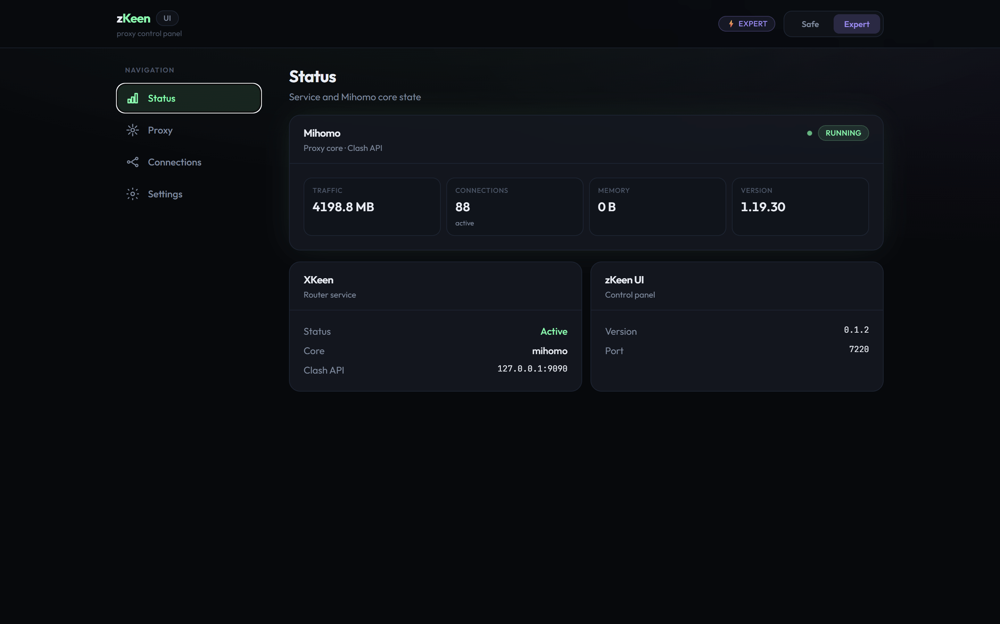

# zKeen UI

[Русский](README.md)

A web panel for **XKeen** and **Mihomo** on Keenetic routers with Entware. Subscription, server selection, rules and updates are managed in the browser, with no file editing over SSH.



## Features

- **Subscription.** Set the link, HWID and User-Agent in the panel. Other provider settings in the config are left as they are.
- **Servers.** Pick a server for each group, switch all groups to one server, test latency, refresh the subscription and GEO databases.
- **Groups and rules.** Create, rename and delete groups together with their rules. References to a group in other rules are updated automatically.
- **Policies.** Route individual devices (by IP) and domains through the proxy or directly.
- **Config editor.** The core checks the config before it is saved, and the previous file is backed up. If Mihomo rejects the new config, the panel restores the previous one on its own.
- **Monitoring.** Core status, traffic, active connections and Mihomo logs.
- **Updates.** zKeen UI and Mihomo are updated from the panel. A beta channel is available if you want to try new things earlier.

**Safe** mode asks for confirmation and validates every change. **Expert** mode unlocks extra settings and config editing without mandatory validation.

## Requirements

- A Keenetic router with Entware installed and SSH access.
- An **aarch64** (ARM64) or **mipsel** CPU.
- The `curl` and `ca-certificates` packages:

```sh
opkg update
opkg install curl ca-certificates
```

## Installation

Connect to the router over SSH and run:

```sh
sh -c "$(curl -fsSL https://raw.githubusercontent.com/dz0l/zKeen/main/install.sh)"
```

The script installs zKeen UI, plus XKeen and Mihomo if they are not installed yet.

After installation the panel is available at `http://<router IP>:7220`. On first launch it asks for your subscription link.

If your Keenetic uses policy-based routing, add the devices you need to the **XKeen** policy in the router web interface.

## Beta versions

Beta builds are published as Pre-releases on the [Releases](https://github.com/dz0l/zKeen/releases) page. They get new features earlier but may contain bugs, so save a copy of `/opt/etc/mihomo/config.yaml` before switching (the "Export" button in the config editor).

The channel is switched in the panel: **Settings → Updates → zkeen-ui beta versions** (visible in Expert mode).

## If the panel does not open

```sh
zkeen status           # is the service running
zkeen restart          # restart the panel
zkeen reset-password   # reset the panel password
```

The default port is 7220. If you changed it in the settings, use the new one.

## Uninstall

```sh
sh -c "$(curl -fsSL https://raw.githubusercontent.com/dz0l/zKeen/main/install.sh)" -- --uninstall
```

The script removes zKeen UI and asks whether to delete its settings. Mihomo, XKeen and the configs in `/opt/etc/mihomo` stay in place.