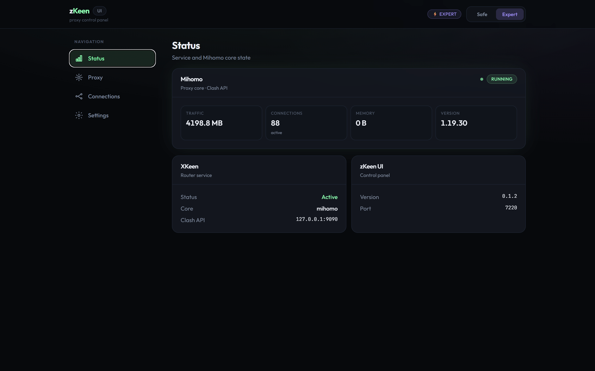

# zKeen UI

[Русский](README.RU.md)

Web panel for **XKeen** / **Mihomo** on Entware devices (primary scenario - Keenetic).

## Requirements

- Primary scenario: Keenetic with Entware (`opkg` is used; Entware-like paths and dependencies are expected).
 *- Also possible on other Entware devices and on a Linux PC - **if** compatible binaries/architecture are available and `/opt` is writable. On unsupported platforms setup may fail.*
- ~ **15 MB** free on `/opt`

```sh
opkg update
opkg install curl ca-certificates
```

## Install (stable)

via SSH:

```sh
sh -c "$(curl -fsSL https://raw.githubusercontent.com/dz0l/zKeen/main/install.sh)"
```

The script installs **zkeen-ui**, and if needed - **XKeen** and **Mihomo**.

Panel: `http://<IP_or_host>:7220`

If you run on Keenetic with policy routing: after install, add devices to the **XKeen policy** in the Keenetic web UI. On other routers/PCs, configure equivalent routing/policy rules (NAT / Policy routing) for your platform.

## Beta (test builds)

**beta** (GitHub Pre-release). Stable (**Latest**).

```sh
# switch to beta
sh -c "$(curl -fsSL https://raw.githubusercontent.com/dz0l/zKeen/main/install.sh)" -- beta
```

**Channel is remembered** in `/opt/etc/xkeen/zkeen-ui.channel`. Later updates without changing the channel stay on beta:

```sh
sh -c "$(curl -fsSL https://raw.githubusercontent.com/dz0l/zKeen/main/install.sh)" -- --update
```

Switch back to stable:

```sh
sh -c "$(curl -fsSL https://raw.githubusercontent.com/dz0l/zKeen/main/install.sh)" -- --stable
# or update to Latest in one step:
sh -c "$(curl -fsSL https://raw.githubusercontent.com/dz0l/zKeen/main/install.sh)" -- --update --stable
```

Check:

```sh
cat /opt/etc/xkeen/zkeen-ui.channel   # beta | stable
zkeen -v
```

for testers:

- Beta may include unfinished changes; back up `/opt/etc/mihomo/config.yaml` before testing.
- Panel updates (**Settings -> Updates**) target stable (Latest). For beta use the SSH commands above.
- Pre-release list: [Releases](https://github.com/dz0l/zKeen/releases)


## Screenshots




## Update

In the panel (stable): **Settings -> Updates -> zkeen-ui**

Or via SSH (uses saved `stable` / `beta` channel):

```sh
sh -c "$(curl -fsSL https://raw.githubusercontent.com/dz0l/zKeen/main/install.sh)" -- --update
```


## Uninstall

```sh
/opt/etc/init.d/S99zkeen-ui stop
rm -f /opt/sbin/zkeen-ui /opt/sbin/zkeen /opt/etc/init.d/S99zkeen-ui
rm -f /opt/etc/xkeen/zkeen-ui.json
rm -f /opt/etc/xkeen/zkeen-ui.channel
```

Does not remove Mihomo configs (`/opt/etc/mihomo`) or XKeen.

## Commands

```sh
zkeen -v                 # version
zkeen -p 8080            # port (default 7220)
zkeen status             # service status
zkeen ?                  # help (same as -h / --help)
/opt/etc/init.d/S99zkeen-ui start|stop|restart|status
zkeen reset-password     # reset panel password
```
